<div align="center">



<br><br>


**Pointez n'importe quel endroit d'un écran. Le code couleur est copié. C'est tout.**

[Installation](#installation) · [Utilisation](#utilisation) · [Fonctionnalités](#fonctionnalités) · [Vie privée](#vie-privée) · [Développement](#développement)

</div>

<br>


<br>

<div align="center">
  
</div>

<br>

## C'est quoi, ColorWeb ?

ColorWeb est une **pipette à couleurs pour Chrome**. Vous lancez l'extension, une loupe suit votre curseur et grossit les pixels, vous cliquez : le code couleur est dans votre presse-papiers, prêt à coller dans votre CSS, Figma ou n'importe quel outil de design.

Pas de compte, pas de pub, pas de collecte de données. Tout se passe dans votre navigateur.

<br>


<br>

## Fonctionnalités

<div align="center">
  
</div>

<br>

| Et aussi | Détail |
| --- | --- |
| **Loupe pixel par pixel** | Pour viser la couleur exacte |
| **Historique** | Les 24 dernières couleurs, cliquables pour les retrouver |
| **Format par défaut** | HEX, RGB ou HSL, mémorisé entre deux sessions |
| **Léger** | Moins de 200 lignes de JavaScript, aucune dépendance |

<br>


<br>

## Installation

> L'extension n'est pas encore sur le Chrome Web Store. En attendant, l'installation prend **2 minutes** avec le mode développeur de Chrome.

### 1. Télécharger

Récupérez [`ColorWeb-extension.zip`](ColorWeb-extension.zip) (bouton **Download raw file** sur la page GitHub du fichier), ou clonez le dépôt.

### 2. Décompresser

Faites un clic droit sur le `.zip` puis **Extraire tout** (Windows) ou double-cliquez dessus (Mac).

> [!IMPORTANT]
> Chrome ne sait pas charger un `.zip` directement : il lui faut le **dossier décompressé**. Rangez-le à un endroit où il ne bougera plus (si vous le déplacez ou le supprimez, l'extension disparaît).

### 3. Charger dans Chrome

1. Ouvrez `chrome://extensions` dans la barre d'adresse
2. Activez **Mode développeur** (en haut à droite)
3. Cliquez sur **Charger l'extension non empaquetée**
4. Choisissez le dossier **`ColorWeb`**, celui qui contient le fichier `manifest.json`
5. Cliquez sur l'icône puzzle de la barre d'outils, puis épinglez **ColorWeb**

C'est prêt.

<details>
<summary><b>Edge, Brave, Opera, Vivaldi…</b></summary>

<br>

Tous les navigateurs basés sur Chromium fonctionnent avec les mêmes étapes. Seule l'adresse change :

| Navigateur | Adresse |
| --- | --- |
| Chrome | `chrome://extensions` |
| Edge | `edge://extensions` |
| Brave | `brave://extensions` |
| Opera | `opera://extensions` |
| Vivaldi | `vivaldi://extensions` |

</details>

<details>
<summary><b>Ça ne marche pas ?</b></summary>

<br>

| Problème | Solution |
| --- | --- |
| *Le fichier manifeste est manquant ou illisible* | Vous avez choisi le mauvais dossier. Sélectionnez celui qui contient directement `manifest.json`. |
| *Impossible de lancer la pipette sur cette page* | Les pages système (`chrome://…`) et le Chrome Web Store interdisent les extensions. Essayez sur un autre site. |
| Un bandeau parle d'extensions en mode développeur au démarrage | Normal tant que l'extension n'est pas sur le Web Store. Vous pouvez le fermer. |
| Le raccourci `Alt + Maj + C` ne fait rien | Un autre programme l'utilise peut-être. Changez-le sur `chrome://extensions/shortcuts`. |
| Vous avez mis à jour les fichiers | Sur `chrome://extensions`, cliquez sur l'icône **Recharger** de la carte ColorWeb. |

</details>

<br>


<br>

## Utilisation

1. Cliquez sur l'icône ColorWeb puis sur **Attraper une couleur**, ou tapez `Alt + Maj + C`
2. Déplacez la loupe sur la couleur voulue
3. **Cliquez** : le code est copié et ajouté à l'historique

| Action | Effet |
| --- | --- |
| `Clic` | Copie la couleur sous la loupe |
| `T` | Active ou désactive le **mode texte** (activé par défaut) |
| `Échap` ou clic droit | Annule sans rien copier |
| Clic sur une pastille de l'historique | Remet cette couleur en courant |
| Boutons `HEX` `RGB` `HSL` | Choisissent le format copié par défaut |

### Formats

| Format | Exemple |
| --- | --- |
| HEX | `#FF9156` |
| RGB | `rgb(255, 145, 86)` |
| HSL | `hsl(21, 100%, 67%)` |

> [!TIP]
> Sur du texte, laissez le **mode texte** activé : les lettres sont lissées par le navigateur, donc la plupart des pixels sont des mélanges flous. Le mode texte repère le pixel le plus éloigné du fond pour récupérer la vraie couleur de la lettre.

<br>


<br>

## Vie privée

ColorWeb ne communique avec **aucun serveur**. Le code ne contient aucune requête réseau, aucun outil de mesure d'audience, aucun traceur. L'historique est stocké uniquement sur votre machine, dans `chrome.storage.local`.

| Permission | Pourquoi |
| --- | --- |
| `activeTab` | Voir l'onglet actif, uniquement quand vous lancez la pipette |
| `scripting` | Injecter la loupe dans la page |
| `storage` | Garder votre historique et votre format préféré |
| `clipboardWrite` | Copier le code couleur |

La capture d'écran de l'onglet est faite en local, lue le temps de la sélection, et n'est jamais enregistrée ni envoyée.

<br>

## Développement

```text
.
├── index.html                  # site de présentation (GitHub Pages)
├── manifest.webmanifest        # PWA : le site s'installe comme une app
├── sw.js                       # PWA : service worker (fonctionne hors ligne)
├── icon-192.png / icon-512.png / icon-maskable-512.png / apple-touch-icon.png
├── ColorWeb-extension.zip      # l'extension, prête à télécharger
├── README.md
├── assets/                     # SVG animés de ce README
│   ├── banner.svg
│   ├── demo.svg
│   ├── features.svg
│   ├── divider.svg
│   └── logo.svg
└── ColorWeb/                   # le code de l'extension (si vous le publiez ici)
    ├── manifest.json
    ├── background.js           # service worker : capture l'onglet, lance la pipette
    ├── content.js              # la loupe et l'échantillonnage des pixels
    ├── popup.html / .css / .js # l'interface de l'extension
    └── icons/
```

**Comment ça marche.** Au lancement, le service worker prend une capture de l'onglet visible (`chrome.tabs.captureVisibleTab`) et injecte `content.js`. La page reçoit un calque transparent qui dessine la capture dans un `<canvas>` invisible : la loupe agrandit une zone de 11 × 11 pixels autour du curseur, et la couleur est lue directement dans ce canvas. Au clic, le code est copié puis ajouté à l'historique.

**Tester une modification.** Modifiez les fichiers du dossier `ColorWeb/`, puis cliquez sur **Recharger** sur `chrome://extensions`.

<br>

<div align="center">


<br>

Fait par Tom.

</div>
